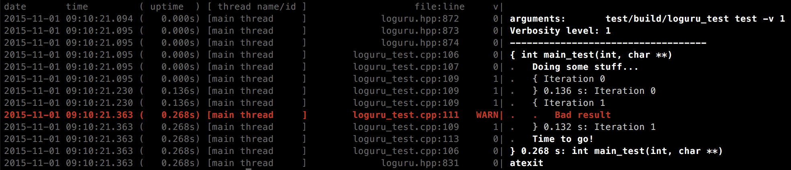

# Loguru: a header-only C++ logging library.

## At a glance



## License
This software is in the public domain. Where that dedication is not recognized, you are granted a perpetual, irrevocable license to copy and modify this file as you see fit.

That being said, I would appreciate credit!
If you find Loguru useful, tweet me at @ernerfeldt mail me at emil.ernerfeldt@gmail.com.

## Why another logging library?
I have yet to come across a nice, light-weight logging library for C++ that does everything I want. So I made one!

In particular, I want logging that produces logs that are both human-readable and easily grep:ed. I also want to be able to hook into the logging process to print some of the more severe messages on-screen in my app (for dev-purposes).

## Features:
* Header only
	* No linking woes! Just include and enjoy.
* Small, simple library.
	* Small header with no `#include`s for **fast compile times** (see separate heading).
	* No dependencies.
	* Cross-platform (but not tested on Windows yet...)
* Flexible:
	* User can install callbacks for logging (e.g. to draw log messages on screen in a game).
	* User can install callbacks for fatal error (e.g. to pause an attached debugger or throw an exception).
* Support multiple file outputs, either trunc or append:
	* e.g. a logfile with just the latest run at low verbosity (high readability).
	* e.g. a full logfile at highest verbosity which is appended to on every run.
* Full featured:
	* Verbosity levels.
	* Supports assertions: `CHECK_F(fp != nullptr, "Failed to open '%s'", filename)`
	* Supports abort: `ABORT_F("Something went wrong, debug value is %d", value)`.
* Stack traces printed on abort.
	* Stack traces are cleaned up somewhat.
		* Before cleanup: `some_function_name(std::__1::vector<std::__1::basic_string<char, std::__1::char_traits<char>, std::__1::allocator<char> >, std::__1::allocator<std::__1::basic_string<char, std::__1::char_traits<char>, std::__1::allocator<char> > > > const&)`
		* After cleanup: `some_function_name(std::vector<std::string> const&)`
	* Stack traces are printed [the right way](http://yellerapp.com/posts/2015-01-22-upside-down-stacktraces.html):
		* Chronological order with the most relevant at the end.
* (most) signals writes stack traces.

* Fast:
	* Around  3us per call with no log file (just stderr).
	* Around 10us extra per log file.
	* About 25%-75% faster than GLOG on my MacBook Pro (Clang).
	* About the same as GLOG on my Linux Disktop (GCC).
* Drop-in replacement for most of GLOG (except for setup code).
* Choose between using printf-style formatting or streams.
* Compile-time checked printf-formating (on supported compilers).
* Assertion failures are marked with `noreturn` for the benefit of the static analyzer and optimizer.
* All logging also written to stderr.
	* With colors on supported terminals.
* Thread-safe.
* Flushes output on each call so you won't miss anything even on hard crashes (and still faster than buffered GLOG!).
* Prefixes each log line with:
	* Date and time to millisecond precision.
	* Application uptime to millisecond precision.
	* Thread name or id.
	* File and line.
	* Log level.
	* Indentation (see *Scopes*).
* Scopes (see *Scopes*).
* grep:able logs:
	* Each line has all the info you need (e.g. date).
	* You can easily filter out high verbosity levels after the fact.

## Compiling

Just include <loguru/loguru.hpp> where you want to use Loguru.
Then, in one .cpp file:
``` C++
	#define LOGURU_IMPLEMENTATION
	#include <loguru/loguru.hpp>
```
Make sure you compile with `-std=c++11 -lpthread -ldl`

## Usage

``` C++
#include <loguru/loguru.hpp>
...
// Optional, but useful to timestamp the start of the log.
// Will also detect verbosity level on comamnd line as -v.
loguru::init(argc, argv);

// Put every log message in "everything.log":
loguru::add_file("everything.log", loguru::Append);

// Only log INFO, WARNING, ERROR and FATAL to "latest_readable.log":
loguru::add_file("latest_readable.log", loguru::Truncate, loguru::INFO);

// Only show most relevant things on stderr:
loguru::g_stderr_verbosity = 1;

LOG_SCOPE_F(INFO, "Will indent all log messages within this scope.");
LOG_F(INFO, "I'm hungry for some %.3f!", 3.14159);
LOG_F(2, "Will only show if verbosity is 2 or higher");
VLOG_F(get_log_level(), "Use vlog for dynamic log level (integer in the range 0-9, inclusive)");
LOG_IF_F(ERROR, badness, "Will only show if badness happens");
auto fp = fopen(filename, "r");
CHECK_F(fp != nullptr, "Failed to open file '%s'", filename);
CHECK_GT_F(length, 0); // Will print the value of `length` on failure.
CHECK_EQ_F(a, b, "You can also supply a custom message, like to print something: %d", a + b);

// Each function also comes with a version prefixed with D for Debug:
DCHECK_F(expensive_check(x)); // Only checked #if !NDEBUG
DLOG_F("Only written in debug-builds");

// Turn off writing to stderr:
loguru::g_alsologtostderr = false;

// Turn off writing err/warn in red:
loguru::g_colorlogtostderr = false;

// Thow exceptions instead of aborting on CHECK fails:
loguru::set_fatal_handler([](const loguru::Message& message){
	throw std::runtime_error(message.message);
})
```

If you prefer logging with streams:

``` C++
#define LOGURU_WITH_STREAMS 1
#include <loguru/loguru.hpp>
...
LOG_S(INFO) << "Look at my custom object: " << a.cross(b);
CHECK_EQ_S(pi, 3.14) << "Maybe it is closer to " << M_PI;
```

## Grep:able logs
``` bash
# Only show warnings, errors and fatal messages:
cat logfile.txt | egrep "[^0-9]\|"

# Ignore verbosity-levels 4 and above:
cat logfile.txt | egrep "[^4-9]\|"

# Only show verbosity-level 6:
cat logfile.txt | egrep "6\|"

# Only show messages from the main thread:
cat logfile.txt | egrep "\[main thread     \]"
```

## No includes in loguru.h
I abhor logging libraries that `#include`'s everything from `iostream` to `windows.h` into every compilation unit in your project. Logging should be frequent in your source code, and thus as lightweight as possible. Loguru's header has *no #includes*. This means it will not slow down the compilation of your project.

In a test of a medium-sized project, including `loguru.hpp` instead of `glog/logging.hpp` everywhere gave about 10% speedup in compilation times.

Note, however, that this gives you the bare-bones version of Louru with printf-style logging. If you want std::ostream style logging (or GLOG functionality) you need to `#define LOGURU_WITH_STREAMS 1` before `#include <loguru/loguru.hpp>`, and that will make loguru.hpp include `<sstream>`. No away around it!

## Scopes
The library supports scopes for indenting the log-file. Here's an example:

``` C++
int main(int argc, char* argv[])
{
	loguru::init(argc, argv);
	LOG_SCOPE_FUNCTION_F(INFO);
	LOG_F(INFO, "Doing some stuff...");
	for (int i=0; i<2; ++i) {
		VLOG_SCOPE_F(1, "Iteration %d", i);
		auto result = some_expensive_operation();
		LOG_IF_F(WARNING, result == BAD, "Bad result");
	}
	LOG_F(INFO, "Time to go!");
	return 0;
}
```

This will output:

```
date       time         ( uptime  ) [ thread name/id ]                   file:line     v|
2015-10-04 15:28:30.547 (   0.000s) [main thread     ]             loguru.cpp:184      0| arguments:       ./loguru_test test -v1
2015-10-04 15:28:30.548 (   0.000s) [main thread     ]             loguru.cpp:185      0| Verbosity level: 1
2015-10-04 15:28:30.548 (   0.000s) [main thread     ]             loguru.cpp:186      0| -----------------------------------
2015-10-04 15:28:30.548 (   0.000s) [main thread     ]        loguru_test.cpp:108      0| { int main_test(int, char **)
2015-10-04 15:28:30.548 (   0.000s) [main thread     ]        loguru_test.cpp:109      0| .   Doing some stuff...
2015-10-04 15:28:30.548 (   0.000s) [main thread     ]        loguru_test.cpp:111      1| .   { Iteration 0
2015-10-04 15:28:30.681 (   0.133s) [main thread     ]        loguru_test.cpp:111      1| .   } 0.133 s: Iteration 0
2015-10-04 15:28:30.681 (   0.133s) [main thread     ]        loguru_test.cpp:111      1| .   { Iteration 1
2015-10-04 15:28:30.815 (   0.267s) [main thread     ]        loguru_test.cpp:113      0| .   .   Bad result
2015-10-04 15:28:30.815 (   0.267s) [main thread     ]        loguru_test.cpp:111      1| .   } 0.134 s: Iteration 1
2015-10-04 15:28:30.815 (   0.267s) [main thread     ]        loguru_test.cpp:115      0| .   Time to go!
2015-10-04 15:28:30.815 (   0.267s) [main thread     ]        loguru_test.cpp:108      0| } 0.267 s: int main_test(int, char **)
```

Which looks like this in the terminal:


(Notice how verbosity levels higher than 0 are slightly gray).

Scopes affects logging on all threads.


## Streams vs printf#
Some logging libraries only supports stream style logging, not printf-style. This means that what in Loguru is:

``` C++
LOG_F(INFO, "Some float: %+05.3f", number);
```

in Glog becomes something along the lines of:

``` C++
LOG(INFO) << "Some float: " << std::setfill('0') << std::setw(5) << std::setprecision(3) << number;
```

Loguru allows you to use whatever style you prefer.


## Limitations and TODO
* Test on Windows.
* Rename ERROR to avoid conflict with windows.h macro?
* File-only logging: LOG_F(FILE, "Always written to file, never to stderr")
